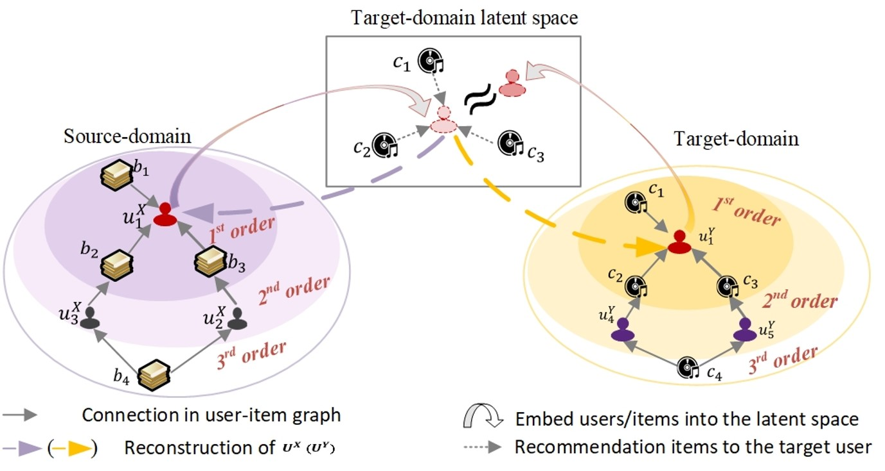
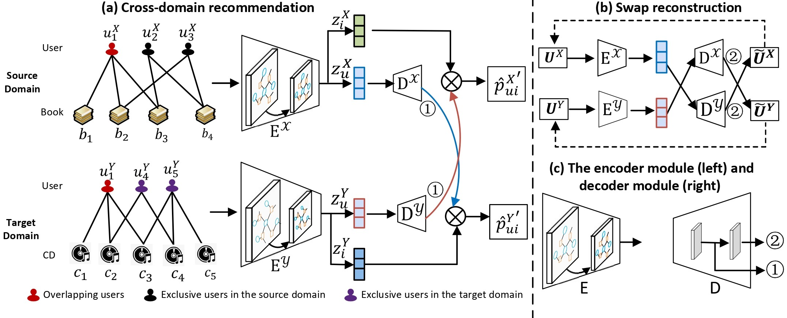

# DAN
Code for paper:

Bei Wang, Chenrui Zhang, Hao Zhang, Xiaoqing Lyu, Zhi Tang, [Dual Autoencoder Network with Swap Reconstruction for Cold-Start Recommendation](https://dl.acm.org/doi/abs/10.1145/3340531.3412069) *(CIKM2020)*

In this paper, we propose an end-to-end Dual Autoencoder Network (DAN) for user cold-start recommendations with a pair of encoder-decoder networks. Conceptually, the proposed encoder in each domain adopts a graph neural network to embed the high-order collaborative information among users and items in the interaction graph via multi-hop propagation for effective
user preference learning. The decoder transforms the user information to the other domain for recommendations.

<p align="center">

</p>

<p align="center">

</p>

## Requirement

- PyTorch
- dgl
- tensorboardX
  
## Dataset
The data set used in this paper is the public data set, which can be found on the [website](https://nijianmo.github.io/amazon/index.html).

## How to run

```bash
cd src
sh run.sh
```
## How to cite
```text
@inproceedings{wang2020dual,
  title={Dual autoencoder network with swap reconstruction for cold-start recommendation},
  author={Wang, Bei and Zhang, Chenrui and Zhang, Hao and Lyu, Xiaoqing and Tang, Zhi},
  booktitle={Proceedings of the 29th ACM International Conference on Information \& Knowledge Management},
  pages={2249--2252},
  year={2020}
}
```
